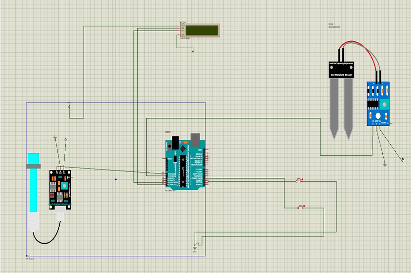

# 🌱 pH Sensor and Moisture Detection System – ECE

## 📌 Project Overview
This ECE project uses pH and soil moisture sensors with Arduino UNO to monitor soil health.  
It supports smart agriculture by providing real-time soil condition data.

## 🎯 Objectives
- Measure soil pH levels accurately.
- Detect soil moisture percentage.
- Display readings via Serial Monitor or LCD.
- Enable calibration for different soil types.

## 🛠️ Components Used
- Arduino UNO
- Analog pH sensor
- Capacitive soil moisture sensor
- LCD display (optional)
- Jumper wires, breadboard, power supply

## ⚡ Circuit Diagram

## 💻 How to Run
1. Connect sensors as per the circuit diagram.
2. Open `https://github.com/Mohan95-gammer/pH-Sensor-and-Moisture-Detection-System-ECE/blob/71ada2cb44fe9196d4934aef20dda6debe3d7688/phsensor_copy_20260105201338.ino` in Arduino IDE.
3. Select board and port, then upload.
4. Open Serial Monitor at 9600 baud to view readings.

## 📊 Sample Output
When running the system, the Serial Monitor displays:
pH: 6.8 | Moisture: 42%
pH: 7.1 | Moisture: 38%
pH: 6.5 | Moisture: 55%
